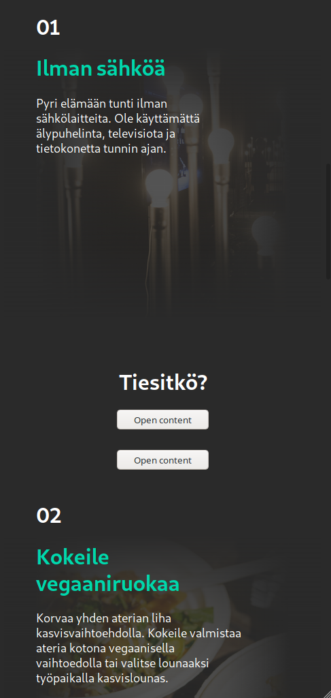

# Hiilineutraalipäivä / Carbon-neutral Day
Hiilineutraalipäivä on virtuaalinen tapahtumasivu, jonka tarkoituksena oli ratkaista ongelma miten saada ihmiset lisäämään omaa tietoisuuttaan ilmaston muutokseen, sekä nostamaan tietoisuutta Helsingin 2035 hiilineutraalisuunnitelmalle. Tarkoituksenamme on haastaa kaikki helsinkiläiset kolmeen hauskaan ympäristöystävälliseen tehtävään, ja jakamaan tulokset sosiaalisessa mediassa hashtagilla #hiilineutraalipäivä tai #hiilineutraalihaaste.

Carbon neutral day is a specific virtual day event for Helsinki residents, where we challenge each and every one to take part in our three environmentally concious challenges and share their results under hashtag #hiilineutraalipäivä or #hiilineutraalihaaste.

[View live demo here!](www.hiilineutraali.herokuapp.com)

## About
This project was made for Metropolia University of Applied Sciences Innovation project course using [React](https://reactjs.org/ "React") and bootstrapped with [Create React App](https://github.com/facebook/create-react-app). Installing requires [NodeJS](https://nodejs.org/en/). 

## Installation
Clone or Download the project as .zip from GitHub and open as a project. In the project directory, you can run:

### `npm install`
_and_
### `npm start`

Which will run the app in the development mode. 
Open [http://localhost:3000](http://localhost:3000) to view it in the browser.

The local version is lacking Nuuka API key, which results in the linechart not showing. You will have to acquire your own API key to show data on the chart.

## Screenshots

| Etusivu     | Haasteet   | Twitter     | Footer |
| :-------------: | :-------------: | :-------------: | :-------------: |
|  |  |  |  |
